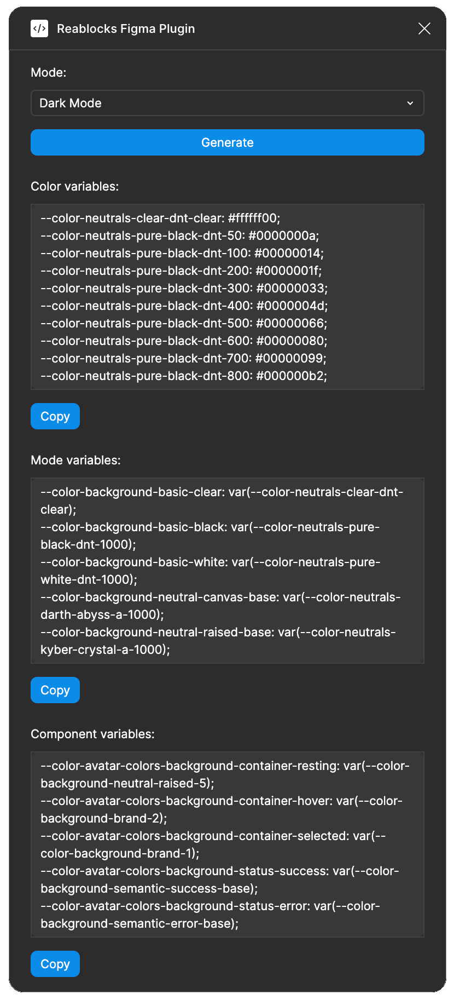

# Reablocks Figma Plugin



Plugin utilities to super charge your dev work for [reablocks](https://github.com/reaviz/reablocks)

## Features

- **Export Styles**: One-click generation of a ready-to-use CSS bundle (zip) containing all theme files
- **Inspect Variables**: Browse and copy individual token sections (root, mode, component, other)

## Export Styles (ready-to-use CSS bundle)

The plugin's primary action exports a zip of CSS files you can drop straight into a reablocks-based project. No manual copy/paste required.

### Pre-requisite

The Figma file must use the Unify Design System variable collections (`Lvl 01 - Root`, `Lvl 02 - Style`, `Lvl 03 (A) - Mode`, `Lvl 03 (C) - Dimension`, `Lvl 04 - Component`). If the plugin can't find these, it shows a "Heads up" screen pointing at [unifydesignsystem.com](https://unifydesignsystem.com).

### Running the export

1. Open the Figma file in the Figma desktop app.
2. Run the **Reablocks Figma Plugin** from the Quick Actions menu (`CMD + P` / `Ctrl + P`).
3. (Optional) If your file has multiple **Style** modes, pick the one you want to export from the **Style** dropdown.
4. Pick the **Default theme** (`Dark` or `Light`) — this is the theme that will be applied at `:root` without needing a wrapping class.
5. Click **Export Styles**. Your browser downloads `<file-name>-styles.zip`.

### What's in the zip

| File | Purpose |
| --- | --- |
| `index.css` | Entry point — imports the other files in the correct order. |
| `common.css` | Base resets, font smoothing, `:root` body styles, tooltip vars. |
| `root.css` | Concrete color hexes and dimension pixel values (the "Level 1" tokens). |
| `light.css` | Light-theme mode tokens. Emitted at `:root` if you picked Light as default, otherwise wrapped in `.theme-light` / `[data-theme='light']` selectors. |
| `dark.css` | Dark-theme mode tokens. Same default/wrapped behavior as `light.css`. |
| `tw.css` | Tailwind v4 `@theme inline` config that re-exports every token for use with Tailwind utility classes. |

### Using the bundle in your project

1. Unzip the archive into your styles folder (e.g. `src/styles/`).
2. Import the entry file once from your app's global stylesheet:
   ```css
   @import "./styles/index.css";
   ```
3. Switch themes at runtime by toggling a class on a wrapping element (or by setting `data-theme`):
   ```html
   <html class="theme-dark">  <!-- or class="theme-light" / data-theme="light" -->
   ```
   You only need this for the *non-default* theme — the default one is already applied at `:root`.

## Inspect Variables (copy individual sections)

For ad-hoc inspection or pulling a single section into an existing stylesheet, open the **Inspect variables** disclosure under the export button:

1. Pick a **Mode** to resolve color aliases against.
2. Click **Generate**. Four sections populate: Root, Mode, Component, and Other (fonts/blurs/shadows).
3. Click **Copy** under any section to put that block on the clipboard.

## Development guide

*This plugin is built with [Create Figma Plugin](https://yuanqing.github.io/create-figma-plugin/).*

### Pre-requisites

- [Node.js](https://nodejs.org) – v18
- [Figma desktop app](https://figma.com/downloads/)

### Build the plugin

To build the plugin:

```
npm run build
```

This will generate a [`manifest.json`](https://figma.com/plugin-docs/manifest/) file and a `build/` directory containing the JavaScript bundle(s) for the plugin.

To watch for code changes and rebuild the plugin automatically:

```
npm run watch
```

### Install the plugin

1. In the Figma desktop app, open a Figma document.
2. Search for and run `Import plugin from manifest…` via the Quick Actions search bar.
3. Select the `manifest.json` file that was generated by the `build` script.

### Debugging

Use `console.log` statements to inspect values in your code.

To open the developer console, search for and run `Open Console` via the Quick Actions search bar.

## See also

- [Create Figma Plugin docs](https://yuanqing.github.io/create-figma-plugin/)
- [`yuanqing/figma-plugins`](https://github.com/yuanqing/figma-plugins#readme)

Official docs and code samples from Figma:

- [Plugin API docs](https://figma.com/plugin-docs/)
- [`figma/plugin-samples`](https://github.com/figma/plugin-samples#readme)
